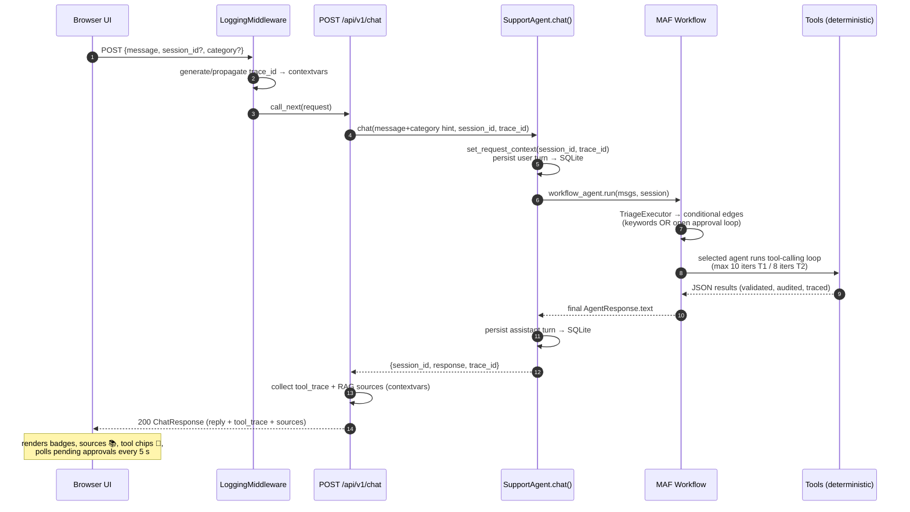
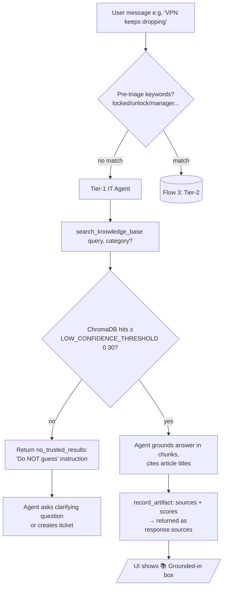
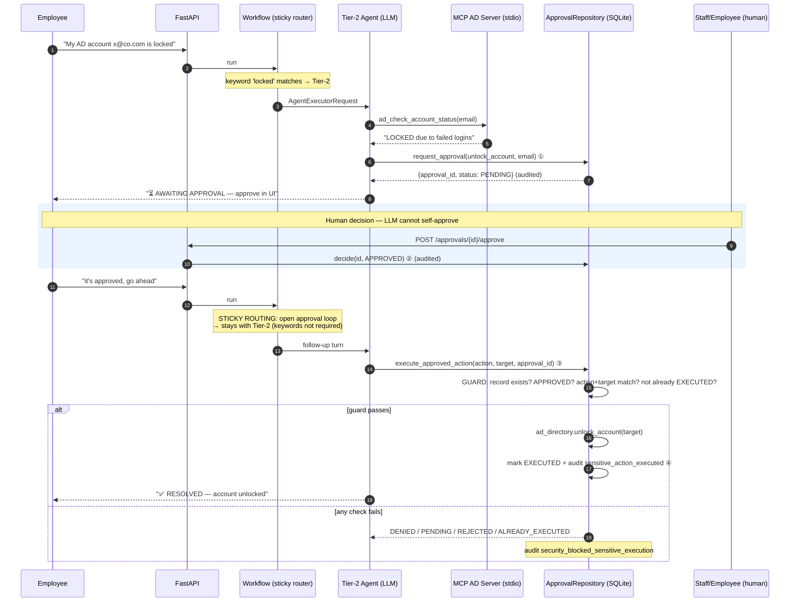
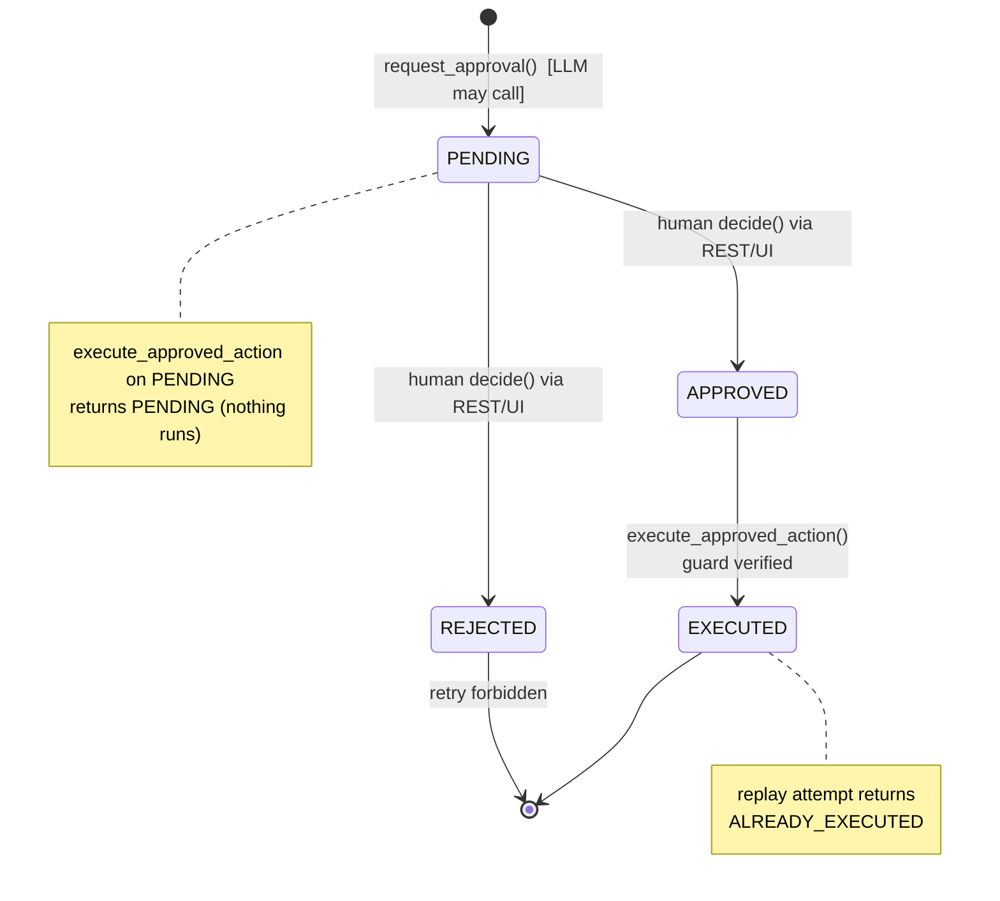
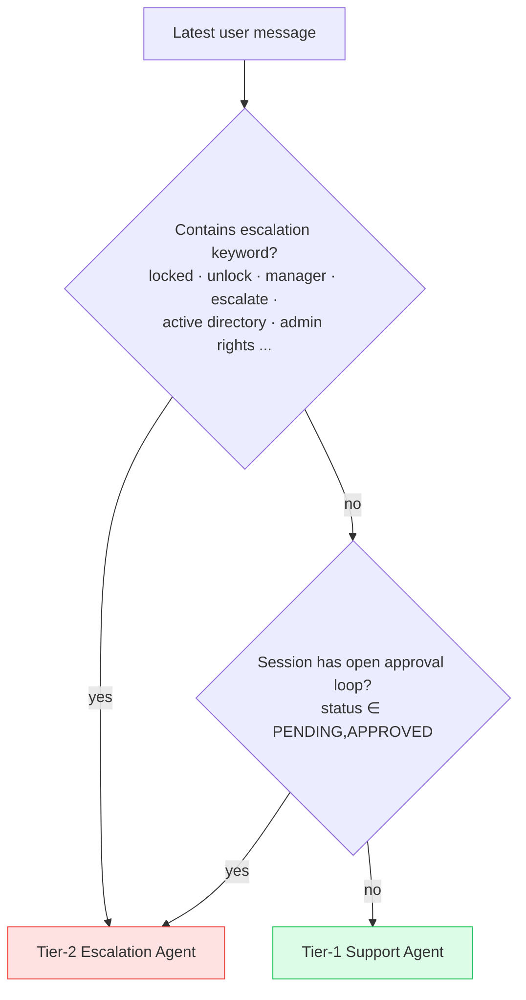

# SupportPilot AI — System Architecture Design

> Version 1.0 · Microsoft Agent Framework (MAF) 1.14.0 · Groq `openai/gpt-oss-120b` · FastAPI · SQLite · ChromaDB · MCP

---

## 1. System Overview

SupportPilot AI is an IT-support chat system where employees describe problems in natural language and a **multi-agent LLM workflow** produces *grounded* troubleshooting answers, performs *controlled* actions (tickets, service lookups), and routes *sensitive* operations through a **code-enforced human-approval gate**.

Design principle: **the LLM decides *what* to do; deterministic code decides *what is allowed*.**

```
                        ┌────────────────────────────────────────────────┐
                        │                  EMPLOYEE / IT STAFF           │
                        └───────────┬───────────────────────▲────────────┘
                                    │ chat / approvals UI   │ replies + approval cards
                            ┌───────▼────────┐              │
                            │  Browser UI    │ static/index.html + styles.css
                            └───────┬────────┘              │
                                    │ HTTPS JSON            │
┌───────────────────────────────────▼───────────────────────────────────────────────┐
│                             FASTAPI APPLICATION LAYER                              │
│   LoggingMiddleware ── routes (chat · tickets · sessions · services · approvals)   │
└───────────────────────────────────┬───────────────────────────────────────────────┘
                                    │ agent.chat(message, session_id, trace_id)
┌───────────────────────────────────▼───────────────────────────────────────────────┐
│                          MAF WORKFLOW (supervisor_agent)                           │
│      TriageExecutor ──conditional edges──▶ Tier-1 Agent │ Tier-2 Agent             │
└──────────────┬──────────────────────────────────┬─────────────────────────────────┘
               │ tools                            │ MCP stdio + approval-gate tools
┌──────────────▼──────────────┐    ┌──────────────▼─────────────────────────────────┐
│ Deterministic tool layer    │    │ Business services (ad_directory)                │
│ RAG search · status · tickets│   │ reachable ONLY via verified approval records    │
└──────────────┬──────────────┘    └──────────────┬─────────────────────────────────┘
               │                                   │
┌──────────────▼───────────────────────────────────▼─────────────────────────────────┐
│        PERSISTENCE: SQLite (Ticket · AuditLog · SessionMessage · ApprovalRequest)  │
│        VECTOR STORE: ChromaDB (knowledge_base/*.md → MiniLM embeddings)            │
└────────────────────────────────────────────────────────────────────────────────────┘
```

---

## 2. Component Responsibilities

| Component | File(s) | Responsibility |
|---|---|---|
| **Web UI** | `static/index.html`, `styles.css` | Chat interface, approvals bell/panel, renders tool-trace chips + RAG source citations, restores sessions |
| **API layer** | `src/api/main.py`, `src/api/routes/*` | HTTP surface, validation via Pydantic schemas, trace-ID lifecycle, error mapping |
| **Middleware** | `core/middleware/logging_middleware.py` | Per-request trace ID (`x-trace-id`), structured access logs, contextvar binding |
| **Supervisor / workflow** | `core/orchestration/router.py` | Builds MAF workflow, conditional routing (incl. sticky approval routing) |
| **Tier-1 agent** | `core/orchestration/agents/tier1_agent.py`, `core/orchestration/prompts/tier1_prompt.py` | Grounded troubleshooting; tools: KB search, service status, ticket create/get |
| **Tier-2 agent** | `core/orchestration/agents/tier2_agent.py`, `core/orchestration/prompts/tier2_prompt.py` | Lockouts/AD matters; MCP read-only lookups + `request_approval` / `execute_approved_action` |
| **History provider** | `core/orchestration/providers/history_provider.py` | Async MAF `HistoryProvider`; idempotent message persistence |
| **Tools** | `src/tools/*` | `@af.tool` functions wrapped by trace decorator; all guardrails applied here |
| **Guardrails** | `core/guardrails/*` | PII redaction, Prompt injection detection, Output hallucination/policy checks |
| **Audit Logger** | `core/audit/audit_logger.py` | Structured JSON auditing for sensitive business events |
| **Approval gate** | `src/tools/approval.py` | `request_approval`, `execute_approved_action` — DB-verified human-in-the-loop |
| **Business services** | `src/services/ad_directory.py` | Mock AD logic shared by MCP server and guarded executor |
| **MCP server** | `src/mcp_server.py` | Stdio FastMCP server exposing **read-only** AD lookups only |
| **RAG** | `src/rag/ingestor.py`, `retriever.py` | Markdown → chunking → MiniLM embeddings → ChromaDB; scored retrieval w/ category filter |
| **Persistence** | `src/persistence/*` | SQLAlchemy models + repositories (validation, auditing, dedup) |
| **Observability** | `src/observability/*` | structlog config, request contextvars, per-request tool-call trace collector |

---

## 3. Flow 1 — Generic Chat Request Lifecycle

Every conversation turn follows this pipeline:



**Trace-ID rule:** one ID per request — generated by middleware, reused by route, agent, logs and response header. Never generated twice.

---

## 4. Flow 2 — Tier-1 Grounded Troubleshooting (RAG)



**Grounding contract:** the KB tool result carries an explicit instruction *"Ground your answer ONLY in these chunks and cite the source titles."* Below-threshold results are dropped server-side before the model ever sees them.

---

## 5. Flow 3 — Tier-2 Escalation & Human Approval (core security flow)



### Approval state machine



**Enforcement layers for `unlock_account`:**

1. Not registered as an MCP tool at all (read-only lookups only).
2. Only reachable via `execute_approved_action`, which re-verifies the DB record independently of anything the LLM claims.
3. Target/action must byte-match the approved record.
4. Every branch (pass or block) writes an `AuditLog` row.

---

## 6. Routing & Triage Logic



- Implemented as MAF conditional edges on one pass-through `TriageExecutor`.
- Both conditions are pure functions of (payload, session context) → fully unit-testable without an LLM.
- Bare *password reset* questions stay Tier-1 (KB covers them); lockouts/unlocks/AD go Tier-2.

---

## 7. Data Model

```
┌──────────────────┐     ┌────────────────────┐     ┌─────────────────────────┐
│ Ticket           │     │ ApprovalRequest    │     │ AuditLog                │
├──────────────────┤     ├────────────────────┤     ├─────────────────────────┤
│ id PK uuid       │     │ id PK uuid         │     │ id PK uuid              │
│ status OPEN..    │     │ session_id idx     │◄──┐ │ session_id idx          │
│ category idx     │     │ action idx         │   │ │ action idx              │
│ priority enum    │     │ target             │   │ │ details JSON            │
│ summary TEXT     │     │ rationale          │   │ │ created_at              │
│ created_at       │     │ status PENDING →   │   │ └─────────────────────────┘
│ updated_at       │     │   APPROVED/REJECTED│   │
└──────────────────┘     │ requested_at       │   │  ┌──────────────────────┐
                         │ decided_at         │   │  │ SessionMessage       │
                         │ executed_at        │   │  ├──────────────────────┤
                         └────────────────────┘   │  │ id PK uuid           │
                                                  └──│ session_id idx       │
                             referenced by             │ message_json TEXT    │
                             tools via contextvars     │ created_at (ordered) │
                                                       └──────────────────────┘
```

Key behaviours:
- **Transcript writes are idempotent**: exact-JSON payloads already stored are skipped, so framework retries can never duplicate history (`SessionRepository.save_messages`).
- Repositories return **detached copies** of ORM objects (safe outside session scope).
- Auditing failures never break the main flow (`log_action` swallows + logs).

---

## 8. Tool Registry & Guardrail Matrix

| Tool | Layer | Inputs (typed) | Guardrail | Side effects |
|---|---|---|---|---|
| `search_knowledge_base` | Tier-1 | `query`, `category?` | Read-only ChromaDB; low-confidence threshold drops weak chunks | artifact: sources+scores |
| `check_service_status` | Tier-1 | `service_name` | **Allow-list** (`SERVICE_ALLOWLIST`); unknown → blocked + audited | none |
| `create_ticket` | Tier-1 | `summary`, `category`, `priority∈{LOW,MEDIUM,HIGH,CRITICAL}` | Repo-level validation (raises → JSON error) | INSERT ticket + audit |
| `get_ticket_status` | Tier-1 | `ticket_id` | Read-only | none |
| `request_approval` | Tier-2 | `action`, `target`, `rationale` | Action must exist in `SENSITIVE_ACTIONS` | INSERT approval + audit |
| `execute_approved_action` | Tier-2 | `action`, `target`, `approval_id` | **DB guard**: APPROVED + matching + not-executed | runs business service + audits both ways |
| MCP `ad_check_account_status` / `ad_get_manager_info` | Tier-2 (stdio subprocess) | `email` | Read-only; spawned with `sys.executable`, self-registers `sys.path` | none |

All local tools are additionally wrapped by `@traced_tool` → per-call `{tool, args(redacted), phase, duration_ms, ok}` events collected into a contextvar and surfaced in the chat response.

---

## 9. Observability Model

```
trace propagation (one ID end-to-end):

x-trace-id header ──▶ middleware binds contextvars ──▶ chat route reuses ──▶ agent logs
                                                                        └─▶ response.trace_id
session_id ──▶ request contextvars ──▶ tools/guards read identity from code, NEVER from LLM

three log/event streams:
1. structlog app logs      : dev = pretty console · prod = JSON; includes http_request timings
2. tool trace (per request): returned IN the ChatResponse → rendered as 🔧 chips in UI
3. AuditLog table (durable): ticket_created · approval_requested/approved/rejected ·
                             sensitive_action_executed · security_blocked_*
```

RAG retrievals log hit counts + top score (`kb_retrieval`, `kb_tool_hit`).

---

## 10. Security Model — Trust Boundaries

```
┌────────────────────────── TRUSTED (deterministic code) ──────────────────────────┐
│  allow-lists · input validation · approval verification · business services ·    │
│  audit writes · session identity (contextvars)                                   │
└──────────────────────────────▲───────────────────────────────────────────────────┘
                              │  narrow, typed interfaces (@af.tool JSON contracts,
                              │  REST endpoints) — outputs validated, inputs sanitized
┌──────────────────────────────┴───────────────────────────────────────────────────┐
│  UNTRUSTED / PROBABILISTIC: LLM outputs · free-text user input · retrieved text  │
└──────────────────────────────────────────────────────────────────────────────────┘
```

Rules enforced:
1. Identity (session_id/trace_id) enters tools via **contextvars**, never via LLM-supplied arguments.
2. No arbitrary SQL/shell/network reachability from any tool; service lookups allow-listed.
3. Secrets live only in `.env` (git-ignored); never logged (tool args redacted).
4. Sensitive capability unreachable except through the verified approval gate.
5. Low-confidence RAG instructs clarification/escalation instead of guessing.

---

## 11. Deployment Topology

**Local:** single uvicorn process; MCP server spawned lazily by MAF as a child process on first Tier-2 use.

```
uvicorn src.api.main:app :8000
 ├── lifespan: init_db() → auto-ingest ChromaDB if empty → build SupportAgent once
 ├── child: python src/mcp_server.py   (stdio, spawned on demand)
 └── files: supportpilot.db · data/chroma/* · agent-file-memory/ (framework cache)
```

**Docker:** `python:3.11-slim`; DB volume-mounted (`./supportpilot.db:/app/supportpilot.db`); KB auto-ingests at first boot.

Startup failure modes are non-fatal by design:
- Missing `GROQ_API_KEY` → boots fine; `/chat` returns explicit config error; all other endpoints work.
- Empty/failed KB ingest → chat still works (ungrounded), warning logged.

---

## 12. MAF 1.14 × Groq Compatibility Constraints

Handled in code; must be preserved across upgrades:

| Constraint | Where handled |
|---|---|
| Use `OpenAIChatCompletionClient`, not `OpenAIChatClient` (no Responses API on Groq) | `core/orchestration/providers/groq_client.py` |
| Harness flags: `disable_web_search=True`, `disable_todo=True`, `disable_mode=True` (Groq rejects injected params/tool schemas) | both agents |
| Custom `HistoryProvider.get_messages/save_messages` **must be `async`** | `core/orchestration/providers/history_provider.py` |
| Workflow routers must `ctx.send_message(...)`; `ctx.yield_output()` terminates the run | `core/orchestration/router.py` |
| Router output wrapped as `AgentExecutorRequest(messages, should_respond=True)` to preserve conversation chain | `core/orchestration/router.py` |
| MCP stdio command = `sys.executable`; server self-inserts project root into `sys.path` | `core/orchestration/agents/tier2_agent.py`, `src/mcp_server.py` |
| `mcp>=1.2,<2.0` pinned (SDK 2.x removed `FastMCP`) | `requirements.txt` |
